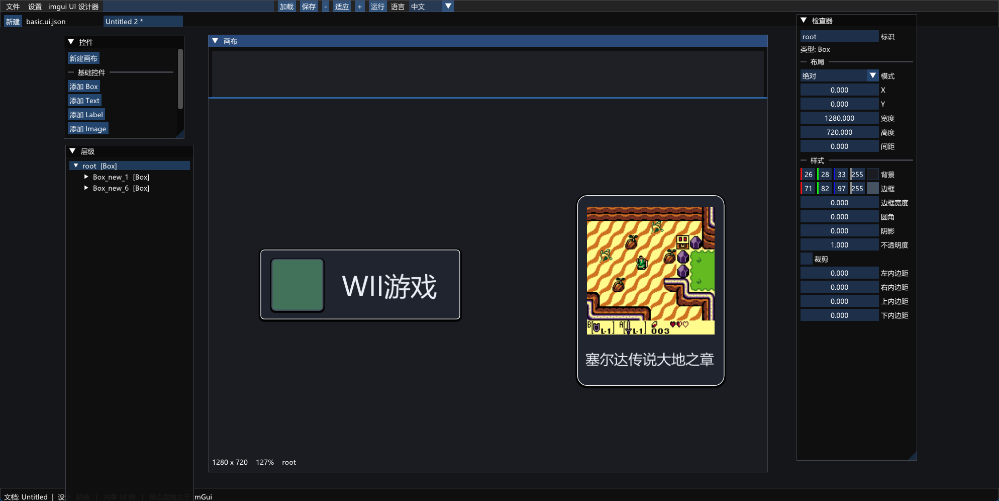

# imgui UI Designer

`imgui UI Designer` 是一个面向 C++/Dear ImGui 项目的桌面 UI 设计器和轻量 UI 运行时。它把 UI 保存为可读、可版本化的 JSON，设计器预览和运行时使用同一棵 `UIElement` 树，便于把设计结果直接集成到游戏、模拟器或工具项目中。

UI 核心、布局、解析器和序列化器不依赖 ImGui；当前 ImGui 只负责桌面设计器壳层和 OpenGL 绘制后端。

## 界面预览



截图展示了当前中文界面：顶部菜单和工具栏、多个文档标签、左侧控件/层级面板、中间画布以及右侧属性检查器。英文界面可在工具栏或“设置”菜单中即时切换。

## 已实现功能

- 基础节点：`Box`、`Text`、`Label`、`Image`
- 布局节点：`absolute`、`horizontal`、`vertical`、`overlay`
- 弹性布局：`HorizontalSpring`、`VerticalSpring`
- 滚动容器：`VerticalScroll`、`HorizontalScroll`
- 在左侧控件栏创建画布、添加节点或导入组件 JSON
- 中间画布实时渲染，检查器直接编辑 ID、布局、尺寸、颜色、文本和图片属性
- 画布缩放、适应窗口、绝对布局节点移动/调整尺寸
- 右键菜单或 `Delete` 删除节点；根节点受保护
- 同时打开多个文档，每个标签独立保存选择、缩放、脏状态和运行/暂停状态
- `运行`/`暂停` 在设计模式和运行模式之间切换
- JSON 保存/加载和 `Ctrl+S` 快捷保存
- JSON 组件引用：一个文档可以引用另一个 JSON，引用节点会展开到当前树中并在序列化时保留引用路径
- 中文（简体）和英文 i18n；窗口尺寸、语言和上次文档保存到 `designer.config.json`
- 字体来自 `resources/fonts/`：`switch_font.ttf` 作主字体（含 CJK），`switch_icons.ttf` 按键图标和 `MaterialIcons-Regular.ttf` 按码位表合并，私用区重叠码位用 `GlyphExcludeRanges` 精确分配
- 通过 `stb_image` 解码 PNG、JPG 和 JPEG 图片，并在 ImGui/OpenGL 后端缓存纹理

按钮、对话框、Tab、Slider 等更高层控件目前建议使用上述基础节点组合；`ui/components/README.md` 是后续复合组件的扩展约定。

## 快速开始

### 依赖

项目使用 Git 子模块提供以下依赖：

- [Dear ImGui](https://github.com/ocornut/imgui)
- [nlohmann/json](https://github.com/nlohmann/json)
- [GLFW](https://github.com/glfw/glfw)
- [stb](https://github.com/nothings/stb)，其中 `stb_image` 用于图片解码

初始化子模块：

```sh
git submodule update --init --recursive
```

需要 CMake 3.24 或更新版本、C++20 编译器以及桌面 OpenGL 开发环境。

### 配置、构建和测试

```sh
cmake -S . -B build -DIMGUI_UI_DESIGNER_BUILD_TESTS=ON
cmake --build build --config Release --parallel 8
ctest --test-dir build -C Release --output-on-failure
```

macOS 上生成可直接双击运行的 `.app`（产物在 `dist/imgui UI Designer.app`）：

```sh
./scripts/package_macos.sh
```

打包脚本会把 `resources/` 和 `examples/` 一起放进 `Contents/Resources`；运行时会按 `IMGUI_DESIGNER_HOME` 环境变量、`.app` bundle 的 `Resources` 目录、编译时的源码目录依次查找资源。

单独检查图片解码（参数可以是 `.png`、`.jpg` 或 `.jpeg`）：

```sh
build/stbi_decode_smoke path/to/image.jpeg
```

### 启动设计器

默认打开 `examples/basic/basic.ui.json`：

```sh
# 单配置生成器
build/imguiUIDesigner

# Windows Visual Studio 多配置生成器
build/Release/imguiUIDesigner.exe
```

也可以把 JSON 文档作为第一个参数：

```sh
build/imguiUIDesigner examples/basic/reference.ui.json
```

设计器会在项目目录读取 `resources/i18n` 和字体资源；退出时写入被 `.gitignore` 忽略的 `designer.config.json`。

## 常用工作流

1. 点击左侧“新建画布”，或直接打开一个已有 JSON。
2. 从“添加 Box/Text/Label/Image”创建节点；选择父节点后导入组件，导入内容会插入到当前树中。
3. 在层级面板或画布中选择节点，在检查器中修改布局和样式。绝对布局节点可以直接拖动和调整大小。
4. 点击“运行”查看运行时更新效果，点击“暂停”回到设计状态。
5. 点击“保存”或按 `Ctrl+S` 写回当前文档。未保存修改会在文档标签后显示 `*`。

## JSON 文档

最小文档示例：

```json
{
  "version": 1,
  "root": {
    "type": "Box",
    "id": "root",
    "layout": { "mode": "vertical", "width": 1280, "height": 720 },
    "style": { "background": "#202020" },
    "children": [
      { "type": "Label", "id": "title", "text": "Hello" }
    ]
  }
}
```

组件引用使用 `reference` 字段，路径相对于宿主 JSON 文件：

```json
{
  "type": "Box",
  "id": "screen",
  "children": [
    { "reference": "../components/label.ui.json" }
  ]
}
```

可直接运行的示例：

- `examples/basic/basic.ui.json`：基础节点、弹簧布局和滚动内容
- `examples/basic/vertical-scroll.ui.json`：独立滚动容器示例
- `examples/basic/reference.ui.json`：引用 `examples/components/label.ui.json`
- `examples/components/label.ui.json`：可复用的 Label 组件

## 代码结构

```text
ui/core/       UIElement、布局数据、样式和状态
ui/layout/     Absolute/Horizontal/Vertical/Overlay、Spring 布局
ui/containers/ Scroll 容器
ui/parser/     JSON 解析、引用展开和序列化
ui/runtime/    更新、布局和渲染调度
ui/renderer/   UIRenderer 接口及 ImGui/OpenGL 实现
ui/i18n/       与渲染器无关的本地化服务
designer/      画布、控件栏、层级、检查器、工具栏和设置
resources/     中英文目录、字体和主题资源
tests/         UI 核心和 stb_image 解码冒烟测试
```

## 当前限制

- 当前桌面渲染后端是 ImGui + OpenGL；其他渲染后端接口已隔离但尚未实现。
- 图片支持 `contain`、`cover` 和 `stretch`；文件不可读时显示占位信息。
- 文本对齐已支持，自动换行仍在规划中；字体字号固定 18px，未接 UI 缩放。
- 画布编辑已有选择、缩放、平移、移动/调整尺寸和删除操作；撤销/重做接口尚未覆盖所有属性编辑。
- 当前没有原生文件选择器，需要在顶部路径输入框中填写加载/保存路径。

## 许可

项目代码遵循仓库中的 [LICENSE](LICENSE)。第三方依赖保留各自的上游许可证，`third_party/` 下的源码不应直接修改。
